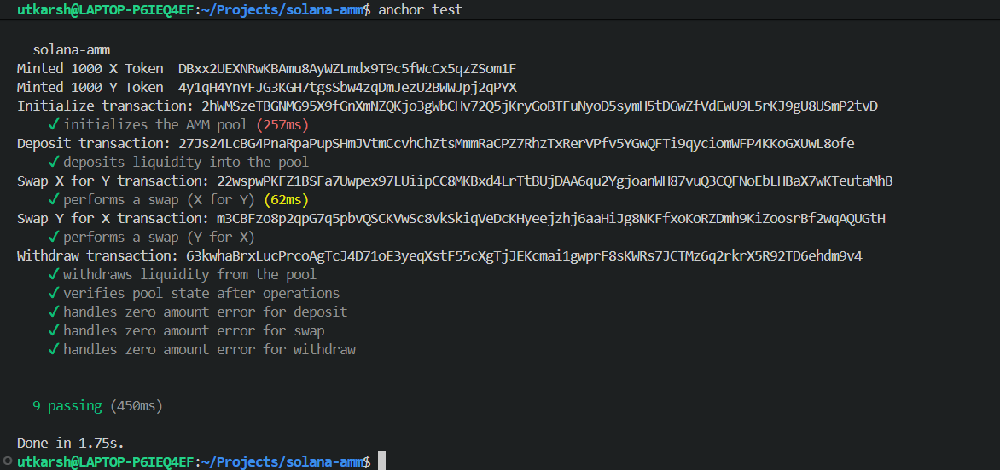

# Solana AMM (Automated Market Maker)

A decentralized Automated Market Maker (AMM) protocol built on Solana using Anchor framework. This program enables users to create liquidity pools, deposit/withdraw liquidity, and perform token swaps with dynamic pricing based on the constant product formula.

## Overview

The Solana AMM is a smart contract system that implements a decentralized exchange mechanism similar to Uniswap V2. It allows users to:

- **Initialize** new liquidity pools with two tokens (Token X and Token Y)
- **Deposit** liquidity into pools and receive LP tokens
- **Swap** between tokens with slippage protection
- **Withdraw** liquidity by burning LP tokens

## Features

### 1. Pool Initialization
- Create new AMM pools with configurable parameters
- Set transaction fees for each pool
- Support for optional authority control
- PDA-based pool identification using seeds

### 2. Liquidity Management
- **Deposit**: Add both tokens to the pool and receive LP tokens representing your share
- **Withdraw**: Burn LP tokens to retrieve your share of both tokens plus accrued fees
- Proportional liquidity management using constant product formula (x × y = k)

### 3. Token Swaps
- Swap Token X for Token Y or vice versa
- Slippage protection with minimum output amounts
- Automatic fee collection
- Dynamic pricing based on pool reserves

### 4. State Management
- Pool configuration including fees, tokens, and authority
- Vault accounts for holding token reserves
- LP token minting and burning

## Program Architecture

### Modules

- **`lib.rs`**: Main program entry point with instruction handlers
- **`instructions/`**: Modular instruction implementations
  - `initialize.rs`: Pool initialization logic
  - `deposit.rs`: Liquidity deposit logic
  - `swap.rs`: Token swap logic
  - `withdraw.rs`: Liquidity withdrawal logic
- **`state.rs`**: Account data structures
- **`error.rs`**: Custom error types
- **`constants.rs`**: Program constants

### Key Instructions

```rust
pub fn initialize(ctx: Context<Initialize>, seed: u64, fee: u16, authority: Option<Pubkey>) -> Result<()>
pub fn deposit(ctx: Context<Deposit>, amount: u64, max_x: u64, max_y: u64) -> Result<()>
pub fn withdraw(ctx: Context<Withdraw>, lp_amount: u64, min_x: u64, min_y: u64) -> Result<()>
pub fn swap(ctx: Context<Swap>, amount_in: u64, min_amount_out: u64, is_x: bool) -> Result<()>
```

## Testing

The program includes comprehensive integration tests covering:

### Test Suite

✅ **Pool Initialization** - Verifies correct pool creation and state setup
✅ **Liquidity Deposit** - Tests adding liquidity and LP token minting
✅ **Token Swap (X → Y)** - Validates forward token exchange
✅ **Token Swap (Y → X)** - Validates reverse token exchange
✅ **Liquidity Withdrawal** - Tests LP token burning and token redemption
✅ **Pool State Verification** - Confirms pool state consistency
✅ **Zero Amount Error Handling** - Validates error handling for invalid inputs
✅ **Swap Error Handling** - Ensures proper error responses

### Running Tests

```bash
# Run all tests
anchor test

# Run tests with verbose output
anchor test -- --nocapture
```

### Test Results



All tests pass successfully, confirming the correctness of:
- Account initialization and state management
- Token transfers and balance updates
- LP token minting and burning
- Swap calculation accuracy
- Error handling and validation
- Pool state consistency across transactions

## Technical Details

### Constant Product Formula

The AMM uses the constant product formula for pricing:

```
x × y = k
```

Where:
- `x` = Reserve of Token X
- `y` = Reserve of Token Y
- `k` = Constant product (remains unchanged after swaps)

### Slippage Protection

Users can set minimum output amounts to protect against:
- Unfavorable price movements
- Transaction ordering issues
- MEV attacks

Parameters:
- `max_x`, `max_y` for deposits
- `min_amount_out` for swaps
- `min_x`, `min_y` for withdrawals

### Fee Model

The program supports configurable transaction fees:
- Stored in basis points (1 fee = 0.01%)
- Collected during swaps
- Distributed proportionally to LP holders


## Usage Example

```typescript
// Initialize a new AMM pool
const tx = await program.methods
  .initialize(seed, FEE, null)
  .accountsStrict({
    initializer: user.publicKey,
    mintX,
    mintY,
    config,
    vaultX,
    vaultY,
    mintLp,
    tokenProgram: TOKEN_PROGRAM_ID,
    associatedTokenProgram: ASSOCIATED_TOKEN_PROGRAM_ID,
    systemProgram: SYSTEM_PROGRAM_ID,
  })
  .rpc();

// Deposit liquidity
await program.methods
  .deposit(lpAmount, maxX, maxY)
  .accountsStrict({ /* accounts */ })
  .rpc();

// Perform a swap
await program.methods
  .swap(amountIn, minAmountOut, true) // true for X→Y swap
  .accountsStrict({ /* accounts */ })
  .rpc();

// Withdraw liquidity
await program.methods
  .withdraw(lpAmount, minX, minY)
  .accountsStrict({ /* accounts */ })
  .rpc();
```

## Error Handling

The program includes comprehensive error handling:

- `InvalidAmount`: Deposit/swap amounts must be greater than zero
- `InvalidMint`: Incorrect token mints provided
- `PoolLocked`: Operations rejected if pool is locked
- `InsufficientLiquidity`: Not enough liquidity for the operation
- And more...


Proper authorization checks

## Project Structure

```
solana-amm/
├── programs/
│   └── solana-amm/
│       └── src/
│           ├── lib.rs
│           ├── state.rs
│           ├── error.rs
│           ├── constants.rs
│           ├── instructions.rs
│           └── instructions/
│               ├── initialize.rs
│               ├── deposit.rs
│               ├── swap.rs
│               └── withdraw.rs
├── tests/
│   └── solana-amm.ts
├── migrations/
│   └── deploy.ts
├── Anchor.toml
└── Cargo.toml
```


